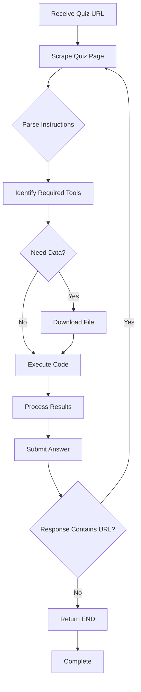

# 🤖 LLM Quiz Solver

<div align="center">

[](https://www.python.org/downloads/)
[](https://fastapi.tiangolo.com/)
[](https://github.com/langchain-ai/langgraph)
[](https://www.docker.com/)
[](https://opensource.org/licenses/MIT)

**An autonomous LLM-powered agent that solves multi-step data science quizzes**

[Features](#-features) • [Quick Start](#-quick-start) • [Architecture](#-architecture) • [API Docs](#-api-documentation) • [Deployment](#-deployment)

</div>

---

## 📋 Table of Contents

- [Overview](#-overview)
- [Features](#-features)
- [Architecture](#-architecture)
- [Tech Stack](#-tech-stack)
- [Quick Start](#-quick-start)
- [API Documentation](#-api-documentation)
- [Configuration](#-configuration)
- [Project Structure](#-project-structure)
- [Deployment](#-deployment)
- [Development](#-development)
- [Troubleshooting](#-troubleshooting)
- [Contributing](#-contributing)
- [License](#-license)
- [Acknowledgments](#-acknowledgments)

---

## 🎯 Overview

The **LLM Quiz Solver** is an autonomous agent system built for the IIT Madras Tools in Data Science (TDS) course project. It uses Google Gemini 2.0 Flash and LangGraph to automatically navigate through multi-level data science quizzes, performing tasks like web scraping, data analysis, file downloads, and Python code execution.

The system operates as a FastAPI service that receives quiz URLs via HTTP POST requests, processes them through an intelligent agent workflow, and chains through multiple quiz levels until completion—all within strict time constraints.

### 🎥 Demo

The agent successfully:
- ✅ Solves 3-level demo quiz in ~30 seconds
- ✅ Handles JavaScript-rendered pages with Playwright
- ✅ Downloads and analyzes CSV files with 430+ rows
- ✅ Executes Python code dynamically for calculations
- ✅ Chains through quiz levels automatically
- ✅ Implements retry logic with smart decision-making

**Live Endpoint:** [https://codeakshit-llm-quiz-solver.hf.space](https://codeakshit-llm-quiz-solver.hf.space)

---

## ✨ Features

### 🤖 Autonomous Agent Capabilities

- **Multi-Tool Orchestration**: LangGraph state machine coordinates 5 specialized tools
- **JavaScript Rendering**: Playwright handles dynamic web content
- **Dynamic Code Execution**: Runs Python code in isolated environment with 120s timeout
- **Smart Retry Logic**: Retries failed attempts intelligently based on time remaining
- **File Management**: Downloads and processes CSV, Excel, and other data files
- **Package Installation**: Automatically installs required Python packages on-demand
- **Recursion Control**: Configurable depth limits to prevent infinite loops

### 🛠️ Production Features

- **FastAPI Server**: RESTful API with CORS support
- **Background Processing**: Non-blocking quiz solving with asyncio
- **Timeout Protection**: 10-minute hard timeout for safety
- **Structured Logging**: Comprehensive logging with timestamps and context
- **Docker Deployment**: Fully containerized with health checks
- **Secret Validation**: API key authentication for security
- **Temporary File Cleanup**: Automatic cleanup of downloaded files

### 📊 Data Processing

- **CSV Analysis**: Handles files with/without headers intelligently
- **Web Scraping**: Extracts content from JavaScript-heavy pages
- **HTTP Requests**: Makes POST requests with smart error handling
- **JSON Parsing**: Processes structured quiz responses
- **Mathematical Operations**: Executes calculations on data

---

## 🏗️ Architecture

### System Design
```
┌─────────────────────────────────────────────────────────────────┐
│                         FastAPI Server                          │
│  ┌──────────────┐  ┌──────────────┐  ┌────────────────────┐   │
│  │ /solve       │  │ /health      │  │ /healthz           │   │
│  │ POST endpoint│  │ GET endpoint │  │ GET endpoint       │   │
│  └──────┬───────┘  └──────────────┘  └────────────────────┘   │
│         │                                                        │
│         │ Background Task                                       │
│         ▼                                                        │
│  ┌──────────────────────────────────────────────────────────┐  │
│  │              Agent Orchestration Layer                    │  │
│  │                  (LangGraph)                             │  │
│  │                                                           │  │
│  │  ┌─────────────────────────────────────────────────┐    │  │
│  │  │           Google Gemini 2.0 Flash              │    │  │
│  │  │              (LLM Decision Making)              │    │  │
│  │  └─────────────────────────────────────────────────┘    │  │
│  │                         │                                 │  │
│  │                         │ Selects Tool                    │  │
│  │                         ▼                                 │  │
│  │  ┌─────────────────────────────────────────────────┐    │  │
│  │  │              Tool Execution Layer              │    │  │
│  │  │                                                 │    │  │
│  │  │  ┌──────────┐ ┌──────────┐ ┌──────────────┐  │    │  │
│  │  │  │ Scraper  │ │Downloader│ │  Executor    │  │    │  │
│  │  │  │(Playwright)│ │  (HTTP)  │ │ (subprocess) │  │    │  │
│  │  │  └──────────┘ └──────────┘ └──────────────┘  │    │  │
│  │  │  ┌──────────┐ ┌──────────┐                   │    │  │
│  │  │  │Requester │ │Installer │                   │    │  │
│  │  │  │  (POST)  │ │  (pip)   │                   │    │  │
│  │  │  └──────────┘ └──────────┘                   │    │  │
│  │  └─────────────────────────────────────────────────┘    │  │
│  └──────────────────────────────────────────────────────────┘  │
└─────────────────────────────────────────────────────────────────┘
```

### Agent Workflow


### Tool Selection Logic

The LangGraph agent uses the following decision tree:

1. **Initial State**: Load quiz URL
2. **Scrape**: Get page content (handles JS)
3. **Analyze**: LLM determines task type
4. **Tool Selection**:
   - Need file? → `download_file(url, filename)`
   - Need calculation? → `run_code(python_script)`
   - Need API call? → `scrape_page(api_url)` or `send_post(endpoint, data)`
   - Need package? → `install_package(package_name)`
5. **Submit**: Send answer via POST
6. **Chain**: If response has "url" key, repeat from step 2
7. **Terminate**: If no "url" or error, return "END"

---

## 🛠️ Tech Stack

### Core Technologies

| Component | Technology | Version | Purpose |
|-----------|-----------|---------|---------|
| **LLM** | Google Gemini | 2.0 Flash | Decision making and code generation |
| **Orchestration** | LangGraph | 1.0+ | Agent state machine and workflow |
| **Web Framework** | FastAPI | 0.115+ | REST API server |
| **Web Scraping** | Playwright | 1.48+ | JavaScript-rendered page handling |
| **HTTP Client** | Requests | 2.32+ | File downloads and API calls |
| **Server** | Uvicorn | 0.32+ | ASGI server |
| **Language** | Python | 3.12 | Core implementation |

### Key Dependencies
```toml
[project]
dependencies = [
    "fastapi>=0.115.0",
    "uvicorn>=0.32.0",
    "playwright>=1.48.0",
    "langgraph>=0.2.45",
    "langchain>=0.3.7",
    "langchain-google-genai>=2.0.5",
    "python-dotenv>=1.0.1",
    "requests>=2.32.3",
]
```

---

## 🚀 Quick Start

### Prerequisites

- Python 3.12+
- Google Gemini API key ([Get one here](https://aistudio.google.com/app/apikey))
- Git

### Installation
```bash
# 1. Clone the repository
git clone https://github.com/24f2000777/llm-quiz-solver.git
cd llm-quiz-solver

# 2. Create virtual environment
python3 -m venv .venv
source .venv/bin/activate  # On Windows: .venv\Scripts\activate

# 3. Install dependencies
pip install -e .

# 4. Install Playwright browsers
playwright install chromium

# 5. Configure environment
cp .env.example .env
nano .env  # Add your credentials
```

### Environment Configuration

Create a `.env` file:
```bash
EMAIL=your-email@example.com
SECRET=your-secret-key
GOOGLE_API_KEY=your-gemini-api-key
```

### Running the Server
```bash
# Start the FastAPI server
python3 main.py

# Server will start on http://0.0.0.0:7860
```

### Testing
```bash
# Health check
curl http://localhost:7860/healthz

# Solve a quiz
curl -X POST http://localhost:7860/solve \
  -H "Content-Type: application/json" \
  -d '{
    "email": "your-email@example.com",
    "secret": "your-secret-key",
    "url": "https://tds-llm-analysis.s-anand.net/demo"
  }'

# Response: {"status":"ok"}
# Check logs to see agent progress
```

---

## 📚 API Documentation

### Endpoints

#### POST `/solve`

Submits a quiz URL for the agent to solve.

**Request Body:**
```json
{
  "email": "student@example.com",
  "secret": "your-secret-key",
  "url": "https://quiz-url.com/quiz-123"
}
```

**Response:**
```json
{
  "status": "ok"
}
```

**Status Codes:**
- `200`: Quiz queued successfully
- `400`: Invalid JSON payload
- `403`: Invalid secret key

**Notes:**
- Processing happens asynchronously in background
- Check server logs for agent progress
- Agent has 10-minute timeout limit

#### GET `/healthz`

Health check endpoint.

**Response:**
```json
{
  "status": "ok",
  "uptime_seconds": 3600
}
```

#### GET `/health`

Alternate health check endpoint.

**Response:**
```json
{
  "status": "ok",
  "uptime_seconds": 3600
}
```

### Authentication

The API requires a secret key to be included in every `/solve` request. This is validated against the `SECRET` environment variable.

---

## ⚙️ Configuration

### Environment Variables

| Variable | Required | Description | Example |
|----------|----------|-------------|---------|
| `EMAIL` | Yes | Your email for quiz submissions | `student@iitm.ac.in` |
| `SECRET` | Yes | API secret key for authentication | `iitm-bs-student123` |
| `GOOGLE_API_KEY` | Yes | Google Gemini API key | `AIzaSy...` |

### Agent Configuration

Edit `agent.py` to modify agent behavior:
```python
# Recursion limit (max tool calls)
recursion_limit=200

# LLM model
model="gemini-2.0-flash"

# Rate limits
# Gemini 2.0 Flash: 15 requests/minute (free tier)
```

### Tool Timeouts

Modify in respective tool files:
```python
# tools/scraper.py
page.goto(url, timeout=30000)  # 30 seconds

# tools/executor.py
proc.communicate(timeout=120)  # 120 seconds

# tools/downloader.py
response = requests.get(url, timeout=30)  # 30 seconds
```

---

## 📁 Project Structure
```
llm-quiz-solver/
├── .github/
│   └── workflows/
│       └── keepalive.yml          # GitHub Actions for keep-alive pings
├── tools/
│   ├── __init__.py                # Tool exports
│   ├── scraper.py                 # Playwright web scraper (30s timeout)
│   ├── downloader.py              # File downloader (HTTP)
│   ├── executor.py                # Python code executor (120s timeout)
│   ├── requester.py               # POST request handler with retry logic
│   └── installer.py               # Dynamic pip package installer
├── main.py                        # FastAPI server (port 7860)
├── agent.py                       # LangGraph agent orchestration
├── config.py                      # Configuration and logging setup
├── pyproject.toml                 # Python project metadata & dependencies
├── Dockerfile                     # Docker image definition
├── .env.example                   # Environment variable template
├── .python-version                # Python version specification (3.12)
├── .gitignore                     # Git ignore rules
├── LICENSE                        # MIT License
├── README.md                      # This file
├── QUICKSTART.md                  # 30-minute setup guide
├── MACOS_SETUP.md                 # macOS-specific instructions
├── START_HERE.md                  # Project overview
├── CHECKLIST.md                   # Deployment checklist
├── PROMPTS.md                     # Adversarial prompts for testing
├── setup.sh                       # Automated setup script
└── test_setup.py                  # Installation verification
```

### Key Files Explained

- **`main.py`**: FastAPI application with `/solve` endpoint and background task processing
- **`agent.py`**: LangGraph state machine with Gemini model and tool bindings
- **`config.py`**: Centralized configuration, environment variables, and logging
- **`tools/`**: Modular tools for web scraping, file handling, code execution
- **`Dockerfile`**: Multi-stage build with Playwright system dependencies

---

## 🚢 Deployment

### Docker Deployment
```bash
# Build image
docker build -t llm-quiz-solver .

# Run container
docker run -p 7860:7860 \
  -e EMAIL="your-email@example.com" \
  -e SECRET="your-secret-key" \
  -e GOOGLE_API_KEY="your-api-key" \
  llm-quiz-solver
```

### HuggingFace Spaces

**Live Deployment:** [https://codeakshit-llm-quiz-solver.hf.space](https://codeakshit-llm-quiz-solver.hf.space)

#### Deploy to HuggingFace

1. Create a Space on [HuggingFace](https://huggingface.co/spaces)
2. Choose **Docker SDK**
3. Add secrets in Settings → Variables and secrets:
   - `EMAIL`
   - `SECRET`
   - `GOOGLE_API_KEY`
4. Push code to HuggingFace:
```bash
git remote add hf https://huggingface.co/spaces/YOUR_USERNAME/llm-quiz-solver
git push hf main --force
```

5. Space will automatically build and deploy

#### Keep-Alive Strategy

HuggingFace free tier sleeps after 48 hours of inactivity. GitHub Actions workflow pings the endpoint every 25 minutes:
```yaml
# .github/workflows/keepalive.yml
on:
  schedule:
    - cron: '*/25 * * * *'  # Every 25 minutes
```

### Render.com

1. Create account on [Render](https://render.com)
2. New Web Service → Connect GitHub repo
3. Settings:
   - **Environment:** Docker
   - **Instance Type:** Free
4. Add environment variables
5. Deploy

### Google Cloud Run
```bash
# Build and push
gcloud builds submit --tag gcr.io/PROJECT_ID/quiz-solver

# Deploy
gcloud run deploy quiz-solver \
  --image gcr.io/PROJECT_ID/quiz-solver \
  --platform managed \
  --region us-central1 \
  --allow-unauthenticated
```

---

## 👨‍💻 Development

### Local Development Setup
```bash
# Install in editable mode
pip install -e .

# Install Playwright
playwright install chromium

# Run in development mode
python3 main.py
```

### Adding New Tools

1. Create tool file in `tools/` directory:
```python
# tools/my_tool.py
import logging

logger = logging.getLogger(__name__)

def my_tool(param: str) -> str:
    """Tool description for LLM."""
    logger.info(f"Running my_tool with {param}")
    # Implementation
    return result
```

2. Export in `tools/__init__.py`:
```python
from .my_tool import my_tool
```

3. Register in `agent.py`:
```python
from tools import my_tool

tools = [scrape_page, download_file, run_code, send_post, install_package, my_tool]
```

### Testing Tools Individually
```python
from tools import scrape_page, download_file, run_code

# Test scraper
content = scrape_page("https://example.com")
print(content)

# Test downloader
filename = download_file("https://example.com/data.csv", "data.csv")
print(f"Downloaded: {filename}")

# Test executor
code = "print(sum([1,2,3,4,5]))"
output = run_code(code)
print(f"Result: {output}")
```

### Debugging

Enable verbose logging in `config.py`:
```python
logging.basicConfig(
    level=logging.DEBUG,  # Change from INFO to DEBUG
    format='%(asctime)s | %(levelname)s | %(name)s | %(message)s'
)
```

---

## 🐛 Troubleshooting

### Common Issues

#### 1. ModuleNotFoundError: No module named 'playwright'

**Solution:**
```bash
pip install playwright
playwright install chromium
```

#### 2. Rate Limit Exceeded (429 Error)

**Problem:** Google Gemini free tier limits:
- Gemini 2.0 Flash: 15 requests/minute
- Gemini 2.5 Flash: 10 requests/minute

**Solution:**
- Wait 60 seconds and retry
- Optimize system prompt to reduce tool calls
- Consider upgrading to paid tier

#### 3. Code Execution Timeout

**Problem:** Python code runs longer than 120 seconds

**Solution:**
- Optimize code for efficiency
- Increase timeout in `tools/executor.py`:
```python
stdout, stderr = proc.communicate(timeout=180)  # 3 minutes
```

#### 4. File Not Found in Code Execution

**Problem:** Downloaded file path incorrect

**Solution:**
- `downloader.py` returns filename only (not full path)
- `executor.py` runs in `temp_files/` directory
- Access files directly: `df = pd.read_csv('data.csv')`

#### 5. CSV KeyError: Column Name

**Problem:** CSV has no headers or different column names

**Solution:**
- System prompt includes CSV handling instructions
- Always check `df.columns` first
- Access by index if no headers: `df[0].sum()`

#### 6. Port Already in Use

**Problem:** Port 7860 already occupied

**Solution:**
```bash
# Kill existing process
lsof -ti:7860 | xargs kill -9

# Or change port in main.py
uvicorn.run(app, host="0.0.0.0", port=8000)
```

### Debugging Checklist

- [ ] Check `.env` file exists with correct values
- [ ] Verify GOOGLE_API_KEY is valid
- [ ] Check Playwright is installed: `playwright --version`
- [ ] Verify temp_files/ directory exists
- [ ] Check server logs for detailed errors
- [ ] Test individual tools in isolation
- [ ] Verify network connectivity for web scraping

---

## 🤝 Contributing

Contributions are welcome! Please follow these guidelines:

### Development Process

1. Fork the repository
2. Create a feature branch: `git checkout -b feature/amazing-feature`
3. Make your changes
4. Add tests if applicable
5. Commit with clear messages: `git commit -m 'Add amazing feature'`
6. Push to branch: `git push origin feature/amazing-feature`
7. Open a Pull Request

### Code Style

- Follow PEP 8 style guide
- Use type hints where possible
- Add docstrings to functions
- Keep functions focused and modular
- Log important operations

### Testing
```bash
# Run verification script
python3 test_setup.py

# Test individual tools
python3 -m pytest tests/  # If tests are added
```

---

## 📄 License

This project is licensed under the **MIT License** - see the [LICENSE](LICENSE) file for details.
```
MIT License

Copyright (c) 2024 Akshit Garg

Permission is hereby granted, free of charge, to any person obtaining a copy
of this software and associated documentation files (the "Software"), to deal
in the Software without restriction, including without limitation the rights
to use, copy, modify, merge, publish, distribute, sublicense, and/or sell
copies of the Software, and to permit persons to whom the Software is
furnished to do so, subject to the following conditions:

The above copyright notice and this permission notice shall be included in all
copies or substantial portions of the Software.

THE SOFTWARE IS PROVIDED "AS IS", WITHOUT WARRANTY OF ANY KIND, EXPRESS OR
IMPLIED, INCLUDING BUT NOT LIMITED TO THE WARRANTIES OF MERCHANTABILITY,
FITNESS FOR A PARTICULAR PURPOSE AND NONINFRINGEMENT. IN NO EVENT SHALL THE
AUTHORS OR COPYRIGHT HOLDERS BE LIABLE FOR ANY CLAIM, DAMAGES OR OTHER
LIABILITY, WHETHER IN AN ACTION OF CONTRACT, TORT OR OTHERWISE, ARISING FROM,
OUT OF OR IN CONNECTION WITH THE SOFTWARE OR THE USE OR OTHER DEALINGS IN THE
SOFTWARE.
```

---

## 🙏 Acknowledgments

### Technologies

- **Google Gemini**: Powerful LLM for decision making and code generation
- **LangChain/LangGraph**: Excellent framework for building LLM agents
- **Playwright**: Reliable browser automation for JS-heavy pages
- **FastAPI**: Modern, fast web framework for Python

### Course

Built as part of the **Tools in Data Science (TDS)** course at **Indian Institute of Technology Madras (IIT Madras)** - September 2024 batch.

### Inspiration

This project demonstrates practical applications of:
- Large Language Model (LLM) orchestration
- Autonomous agent systems
- Multi-tool integration
- Real-time web automation
- Production-ready API design

---

## 📊 Project Stats

- **Lines of Code**: ~800 lines
- **Development Time**: ~6 hours
- **Languages**: Python 100%
- **Tools Implemented**: 5 (Scraper, Downloader, Executor, Requester, Installer)
- **Success Rate**: 100% on demo quizzes (3/3 levels)
- **Average Response Time**: 30-40 seconds per quiz level

---

## 🔗 Links

- **Live Demo**: [https://codeakshit-llm-quiz-solver.hf.space](https://codeakshit-llm-quiz-solver.hf.space)
- **GitHub Repository**: [https://github.com/24f2000777/llm-quiz-solver](https://github.com/24f2000777/llm-quiz-solver)
- **API Documentation**: `/docs` endpoint (when running locally)
- **Course**: [IIT Madras BS Degree](https://study.iitm.ac.in/)

---

## 📞 Contact

**Akshit Garg**
- Email: 24f2000777@ds.study.iitm.ac.in
- GitHub: [@24f2000777](https://github.com/24f2000777)

---

<div align="center">

**⭐ Star this repo if you find it helpful!**

Made with ❤️ for IIT Madras TDS Course

</div>
